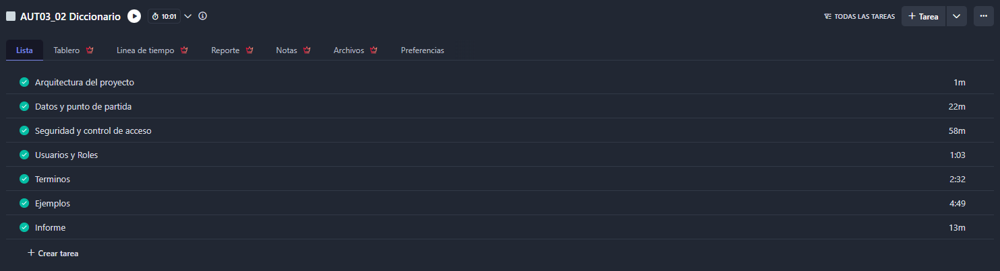

# AUT03_02_Diccionario

Realizar las acciones descritas en el siguiente [documento](https://docs.google.com/document/d/19s1rjyGfGI4YHdoz5jz5p3-EvrsEihE1pyiAe3zLMBc/edit?usp=sharing) para cumplir con todos los requisitos detallados en el mismo.

Se adjunta archivo .sql para generar la base de datos necesaria para realizar esta actividad

El comportamiento de la aplicación ha de ser el que se muestra en el siguiente [video](https://drive.google.com/file/d/1HgOcHFFaAcPJs25dyiENjzSpSpoT7CIE/view?usp=sharing)

Se han realizar commits y subidas de cambios por cada funcionalidad significativa del proyecto (creación del proyecto base, gestión de albums, gestión de artistas, navegación de login, etc)

Además, se tendrá que realizar un informe pdf como indica en el documento y subir todo el proyecto comprimido en .zip a Evagd.

# Diagrama E-R

# Tabla que relaciona entidades con las operaciones CRUD
| Entidad | Crear | Leer | Actualizar | Eliminar |
|---------|-------|------|------------|----------|
| Usuarios|   ✅  |  ✅  |     ✅     |    ❌    |
| Roles   |   ✅  |  ✅  |     ❌     |    ❌    |
| Terms   |   ❌  |  ✅  |     ✅     |    ✅    |
| Examples|   ✅  |  ✅  |     ✅     |    ✅    |

# Horas Utilizadas

